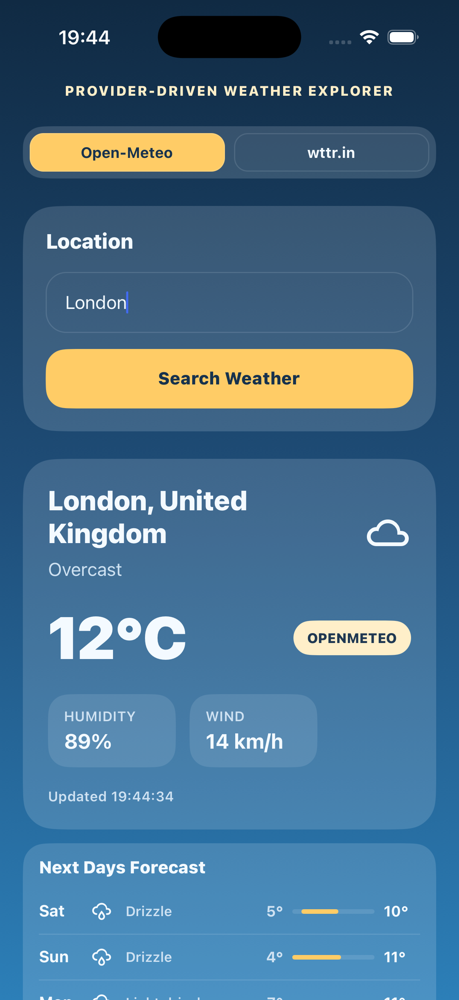
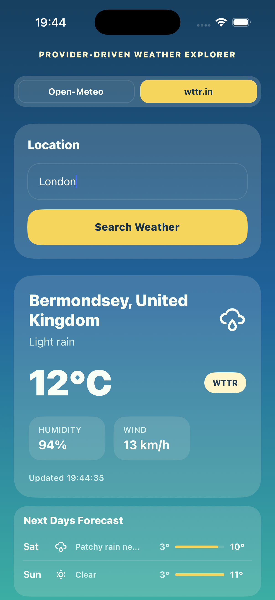

# Weather Provider App

Production-style Expo + React Native weather app with modular provider adapters, Zustand state, TanStack Query server state, Zod validation, and Jest coverage.

<p align="center">
    
    
</p>

---

## Table of Contents

- [Quick Start](#quick-start)
- [Local Setup](#local-setup)
- [Architecture](#architecture)
- [Data Flow](#data-flow)
- [State Management](#state-management)
- [Features](#features)
  - [Unit Toggle](#unit-toggle)
  - [Search History](#search-history)
  - [Geolocation](#geolocation)
  - [Offline Support](#offline-support)
  - [Web Layout](#web-layout)
- [Path Aliases](#path-aliases)
- [Fetch Resilience](#fetch-resilience)
- [Error Boundary](#error-boundary)
- [Weather Icons](#weather-icons)
- [Adding a New Provider](#adding-a-new-provider)
- [Testing](#testing)
- [File Tree](#file-tree)
- [Scripts](#scripts)
- [Troubleshooting](#troubleshooting)

---

## Quick Start

```bash
npm install
npm start
# press i for iOS simulator, a for Android emulator, w for web
```

> **First run on iOS/Android after adding native dependencies** (expo-location, expo-network):
> ```bash
> npx expo prebuild --clean
> npm run ios   # or npm run android
> ```

---

## Local Setup

### Prerequisites

- Node.js 22 LTS (recommended)
- npm 10+
- Xcode — for iOS Simulator on macOS
- Android Studio + Android SDK — for Android emulator
- Expo CLI is not required globally; all commands use `npx` or project scripts

Check your versions:

```bash
node -v
npm -v
```

### Install Dependencies

```bash
npm install
```

### Start the Dev Server

```bash
npm start
```

### Run on a Target

```bash
npm run ios      # iOS Simulator (macOS only)
npm run android  # Android Emulator
npm run web      # Web browser
```

### Run Tests

```bash
npm test
```

---

## Architecture

The project follows a **feature-based, modular architecture**. All weather domain code lives under `src/features/weather/` and is subdivided by concern. Shared infrastructure sits in `src/`.

```
src/
├── app/                    # App root, providers, error boundary, web layout
├── components/             # Shared UI primitives
├── features/
│   └── weather/
│       ├── api/            # Adapter + mapper pattern
│       │   ├── mappers/    # Normalize raw API responses → WeatherData
│       │   ├── providers/  # HTTP adapters implementing WeatherProvider
│       │   └── providerRegistry.ts
│       ├── hooks/          # useWeather — composes store + TanStack Query
│       ├── model/          # TypeScript types, Zod validation, interfaces
│       └── ui/             # Screen + feature components
├── hooks/                  # Shared hooks (useNetworkStatus)
├── store/                  # Zustand store (user preferences)
├── theme/                  # Per-provider gradient and color themes
├── test/                   # Test helpers and test suites
└── utils/                  # fetchJson, weatherIcons, temperature
```

### Key Patterns

**Adapter pattern** — each provider (Open-Meteo, wttr.in) implements the `WeatherProvider` interface. Consumers never reference a concrete adapter directly; they go through the `weatherProviderRegistry`. Adding a third provider means creating one adapter file and one mapper file — nothing else changes.

**Mapper pattern** — adapters delegate response normalization to a dedicated mapper function. The mapper converts the provider-specific shape into the shared `WeatherData` domain model. This keeps adapters thin and mappers independently testable.

**Registry pattern** — `weatherProviderRegistry` is a plain object keyed by `WeatherProviderId`. It acts as a lightweight service locator. Tests inject a custom registry to avoid real network calls.

---

## Data Flow

```
User types location → presses "Search Weather"
  │
  ├─ parseLocationInput()        Zod validation (trim, min/max length, character set)
  │   └─ on failure: show inline error, abort
  │
  ├─ setLastSearchedLocation     API query string (city name or lat,lon)
  ├─ lastSearchedDisplayName     Human-readable label shown in UI + history
  ├─ addToLocationHistory        Prepend to persistent history (max 5, deduped)
  │
  └─ useWeather hook
      ├─ Reads selectedProvider + lastSearchedLocation from Zustand store
      ├─ Waits for hasHydrated = true (prevents duplicate startup fetches)
      └─ TanStack Query → provider.getWeather({ location })
          ├─ fetchJson()          HTTP GET — Promise.race timeout (10s) + 2 retries
          ├─ Adapter maps raw response via mapper function
          └─ Returns WeatherData  Cached for 5 minutes (staleTime)

User presses "Use My Location"
  │
  ├─ Location.requestForegroundPermissionsAsync()
  ├─ Location.getCurrentPositionAsync()       Gets lat/lon from device GPS
  ├─ BigDataCloud reverse geocode API         Resolves city name (no API key needed)
  ├─ lastSearchedLocation = "lat,lon"         Coords sent directly to adapters
  └─ lastSearchedDisplayName = "City Name"    City name shown in UI + history
```

On startup, `AppProviders` calls `hydrateWeatherPreferencesStore()` which reads preferences from AsyncStorage. The query is gated on `hasHydrated`, preventing duplicate fetches before hydration completes.

---

## State Management

| Layer | Tool | What it stores | Persisted |
|---|---|---|---|
| User preferences | Zustand + AsyncStorage | provider, location query, display name, history, unit | Yes |
| Server state | TanStack Query | `WeatherData` per `[provider, location]` key | In-memory (5 min) |
| UI state | React `useState` | Input text, validation error, focus, locating spinner | No |

### Persisted Zustand fields

| Field | Type | Purpose |
|---|---|---|
| `selectedProvider` | `WeatherProviderId` | Last chosen provider |
| `lastSearchedLocation` | `string` | Raw API query — city name or `lat,lon` |
| `lastSearchedDisplayName` | `string` | Human-readable label shown in UI and history |
| `locationHistory` | `string[]` | Up to 5 recent city names (deduped, newest first) |
| `temperatureUnit` | `'celsius' \| 'fahrenheit'` | Preferred temperature unit |

---

## Features

### Unit Toggle

A `°C / °F` toggle sits in the search panel header. The selected unit is persisted to AsyncStorage and applied everywhere temperatures appear.

- `src/utils/temperature.ts` exports `formatTemperature(celsius, unit)` and `formatTemperatureBare(celsius, unit)` (no unit suffix — used in the forecast list)
- `WeatherCard` and `ForecastList` both accept a `temperatureUnit` prop
- Conversion: `°F = (°C × 9/5) + 32`

### Search History

The last 5 searched locations are persisted and shown as suggestions when the input is focused.

- Stored in Zustand under `locationHistory` (max 5 entries, case-insensitive deduplication)
- History always stores the **city name** — never raw coordinates
- Tapping a suggestion immediately submits that location
- The list hides when the input loses focus (150ms debounce so taps register first)

### Geolocation

A crosshairs button next to the search input fetches weather for the device's current position.

**Flow:**
1. Requests `NSLocationWhenInUseUsageDescription` permission (iOS) or `ACCESS_FINE_LOCATION` (Android)
2. Calls `Location.getCurrentPositionAsync()` to get coordinates
3. Calls [BigDataCloud reverse geocoding API](https://api.bigdatacloud.net) to resolve the city name — no API key required
4. Sends **coordinates** to the weather adapters for accuracy (avoids district/raion name lookup failures)
5. Shows the **city name** in the UI and stores it in history

If reverse geocoding fails (offline, unknown area), falls back to raw `lat,lon` string as both the query and display label.

**Open-Meteo adapter** detects `lat,lon` format input and skips its geocoding step, using coordinates directly in the forecast URL.

#### iOS Simulator setup

The simulator has no GPS hardware. Set a simulated location before using the crosshairs button:

`Simulator menu → Features → Location → Custom Location...`

Enter any coordinates, for example Vinnytsia:
- Latitude: `49.2328`
- Longitude: `28.4682`

### Offline Support

`src/hooks/useNetworkStatus.ts` checks connectivity via `expo-network` and re-checks whenever the app returns to the foreground (`AppState` listener).

- **Defaults to `true`** (optimistic) — avoids false negatives on iOS Simulator where `expo-network` can incorrectly report no connection
- When offline + data cached: shows `"You're offline — showing cached data"` banner above the weather card
- When offline + no data: shows `"No connection — connect to the internet and search"` banner
- Network status is **informational only** — the loading state and fetch always proceed regardless, letting TanStack Query surface the error naturally if the device truly has no connection

### Web Layout

On desktop browsers the app renders in a **430px-wide phone-shaped container** centered on a dark background, matching the native mobile proportions.

- Implemented entirely in `src/app/App.tsx` via `Platform.OS !== 'web'` check
- Mobile builds (iOS/Android) are completely unaffected — zero overhead
- Drop shadow frames the container on wide viewports

---

## Path Aliases

All cross-boundary imports use the `@/` alias which maps to `src/`. This is configured in three places so that Metro (runtime), TypeScript (types), and Jest (tests) all agree:

| Config file | Setting |
|---|---|
| `babel.config.js` | `babel-plugin-module-resolver` with `alias: { "@": "./src" }` |
| `tsconfig.json` | `"baseUrl": ".", "paths": { "@/*": ["src/*"] }` |
| `jest.config.js` | `moduleNameMapper: { "^@/(.*)$": "<rootDir>/src/$1" }` |

```ts
// Before
import { fetchJson } from "../../../../utils/fetchJson";

// After
import { fetchJson } from "@/utils/fetchJson";
```

Single-level relative imports within the same folder (`./WeatherCard`, `../model/types`) are kept as-is.

---

## Fetch Resilience

`src/utils/fetchJson.ts` is the single HTTP utility used by all provider adapters and the reverse geocoding call. It provides:

- **10-second timeout** via `Promise.race` — if the server does not respond within 10 seconds a clear error is thrown. Uses `Promise.race` rather than `AbortController` for compatibility with React Native's native fetch on iOS (where `AbortController` signals do not propagate correctly through `NSURLSession`).
- **2 automatic retries** with 500ms / 1000ms back-off on network/timeout failures. HTTP errors (4xx, 5xx) are not retried — they represent a definitive server response.

```
attempt 0: immediate
attempt 1: wait 500ms   (network/timeout only)
attempt 2: wait 1000ms  (network/timeout only)
```

---

## Error Boundary

`src/app/ErrorBoundary.tsx` is a React class component that catches any unhandled JavaScript errors thrown during render. It wraps the entire app in `App.tsx`.

When an error is caught:
- The error is logged to the console with its component stack
- A fallback screen shows the error message and a **Try again** button
- **Try again** resets `hasError`, re-mounting the children and giving the app a chance to recover

---

## Weather Icons

`src/utils/weatherIcons.ts` is the single source of truth for weather condition → icon mapping:

```ts
getWeatherIconName(condition: string): IconName   // MaterialCommunityIcons glyph
mapConditionToEmoji(condition: string): string    // emoji (used by wttr.in mapper)
```

### Open-Meteo WMO Weather Codes

All 28 WMO weather interpretation codes are covered in `openMeteoMapper.ts`:

| Code range | Conditions |
|---|---|
| 0–3 | Clear sky → Overcast |
| 45, 48 | Fog, rime fog |
| 51–57 | Drizzle, freezing drizzle |
| 61–67 | Rain, freezing rain |
| 71–77 | Snow, snow grains |
| 80–82 | Rain showers |
| 85–86 | Snow showers |
| 95, 96, 99 | Thunderstorm, thunderstorm with hail |

---

## Adding a New Provider

1. Create `src/features/weather/api/providers/myProviderAdapter.ts`:

```ts
import { fetchJson } from "@/utils/fetchJson";
import type { WeatherProvider } from "@/features/weather/model/provider";

export class MyProviderAdapter implements WeatherProvider {
  readonly id = "myProvider" as const;
  readonly displayName = "My Provider";

  async getWeather(params: { location: string }) {
    const data = await fetchJson<MyApiResponse>(`https://api.example.com/...`);
    return { provider: this.id, ...mapMyProviderResponse(data) };
  }
}
```

2. Create `src/features/weather/api/mappers/myProviderMapper.ts` returning `Omit<WeatherData, "provider">`.

3. Register in `src/features/weather/api/providerRegistry.ts`.

4. Add id + label to `WEATHER_PROVIDER_OPTIONS` in `src/features/weather/model/types.ts`.

5. Add a theme entry in `src/theme/providerThemes.ts`.

No other changes needed — `ProviderToggle`, `useWeather`, and `WeatherScreen` all read from the registry dynamically.

---

## Testing

```bash
npm test
```

### Test helpers

| File | Purpose |
|---|---|
| `createTestQueryClient.ts` | `QueryClient` with `gcTime: 0` — disables caching between tests |
| `renderWithProviders.tsx` | Wraps components in `QueryClientProvider` |

### Test suites

| Suite | What it covers |
|---|---|
| `weatherValidation.test.ts` | Zod location schema |
| `providerAdapters.test.ts` | Adapter + mapper integration (mocked `fetch`) |
| `useWeather.test.tsx` | Hydration gate, provider switching |
| `WeatherScreen.test.tsx` | Idle, loading, error, success UI states |

### Global mocks (`jest.setup.ts`)

| Mock | Reason |
|---|---|
| `@react-native-async-storage/async-storage` | In-memory map, no native module needed |
| `expo-network` | Returns `{ isConnected: true }` — avoids false offline state in tests |
| `expo-location` | Returns granted permission + mock coordinates + mock reverse geocode result |

---

## File Tree

```text
.
├── App.tsx
├── app.json                        Expo config — includes expo-location plugin + iOS infoPlist
├── babel.config.js                 @/ alias via babel-plugin-module-resolver
├── jest.config.js                  @/ moduleNameMapper
├── jest.setup.ts                   AsyncStorage, expo-network, expo-location mocks
├── package.json
├── tsconfig.json                   @/ paths
└── src
    ├── app
    │   ├── App.tsx                 Root — ErrorBoundary + web phone-frame layout
    │   ├── ErrorBoundary.tsx       Class error boundary with fallback UI + retry
    │   └── providers.tsx           QueryClient setup, store hydration
    ├── components
    │   └── MetricPill.tsx          Shared label+value pill
    ├── features
    │   └── weather
    │       ├── api
    │       │   ├── mappers
    │       │   │   ├── openMeteoMapper.ts   Full 28 WMO codes
    │       │   │   └── wttrMapper.ts
    │       │   ├── providerRegistry.ts
    │       │   └── providers
    │       │       ├── openMeteoAdapter.ts  Detects lat,lon input, skips geocoding
    │       │       └── wttrAdapter.ts
    │       ├── hooks
    │       │   └── useWeather.ts
    │       ├── model
    │       │   ├── provider.ts
    │       │   ├── types.ts
    │       │   └── validation.ts
    │       └── ui
    │           ├── ForecastList.tsx         Forecast with temperatureUnit prop
    │           ├── ProviderToggle.tsx
    │           ├── UnitToggle.tsx           °C / °F toggle
    │           ├── WeatherCard.tsx          Current conditions with temperatureUnit prop
    │           └── WeatherScreen.tsx        Search, history, geolocation, offline banner
    ├── hooks
    │   └── useNetworkStatus.ts             expo-network + AppState listener
    ├── store
    │   └── weatherPreferencesStore.ts      Zustand — provider, location, history, unit
    ├── test
    │   ├── WeatherScreen.test.tsx
    │   ├── createTestQueryClient.ts
    │   ├── providerAdapters.test.ts
    │   ├── renderWithProviders.tsx
    │   ├── useWeather.test.tsx
    │   └── weatherValidation.test.ts
    ├── theme
    │   └── providerThemes.ts
    └── utils
        ├── fetchJson.ts                    Promise.race timeout + 2-retry backoff
        ├── temperature.ts                  formatTemperature / formatTemperatureBare
        └── weatherIcons.ts                 getWeatherIconName / mapConditionToEmoji
```

---

## Scripts

| Command | Description |
|---|---|
| `npm start` | Start Expo dev server |
| `npm run ios` | Run on iOS Simulator |
| `npm run android` | Run on Android Emulator |
| `npm run web` | Run in web browser |
| `npm test` | Run unit tests once |

---

## Troubleshooting

### Native module not found (expo-location / expo-network)

These are native modules and require a full rebuild after install:

```bash
npx expo prebuild --clean
npm run ios   # or npm run android
```

### Location permission denied on iOS

The `NSLocationWhenInUseUsageDescription` key must be present in `Info.plist`. It is set via `app.json → ios.infoPlist` and applied during `expo prebuild`. If you see the error, run `npx expo prebuild --clean` and rebuild.

### Location not working in iOS Simulator

The simulator has no GPS. Set a simulated location first:

`Simulator menu → Features → Location → Custom Location...`

### Metro cache issues

```bash
npx expo start -c
```

### Dependency issues

```bash
rm -rf node_modules package-lock.json
npm install
```

### iOS build issues

```bash
cd ios && pod install && cd ..
npm run ios
```

### Android emulator not detected

Ensure an emulator is running in Android Studio first.

### Path alias not resolving

If you see `Cannot find module '@/...'`:
- **Metro**: clear cache with `npx expo start -c`
- **TypeScript**: verify `baseUrl` and `paths` in `tsconfig.json`, restart TS server
- **Jest**: verify `moduleNameMapper` in `jest.config.js`
